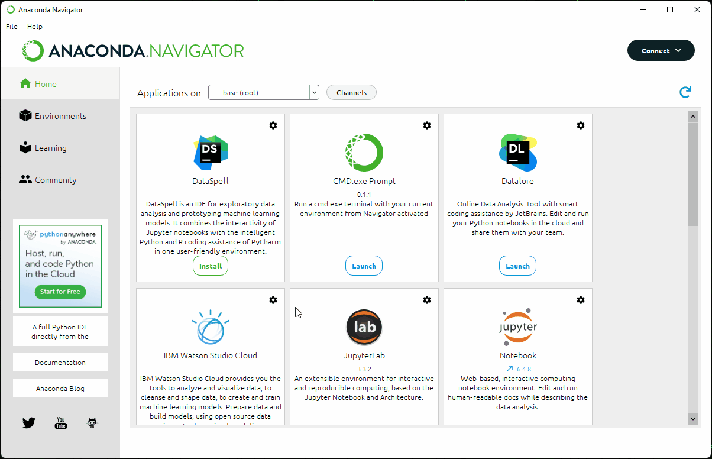
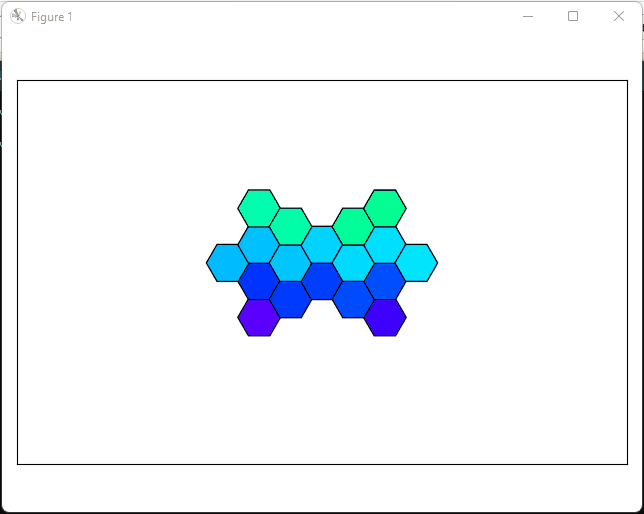
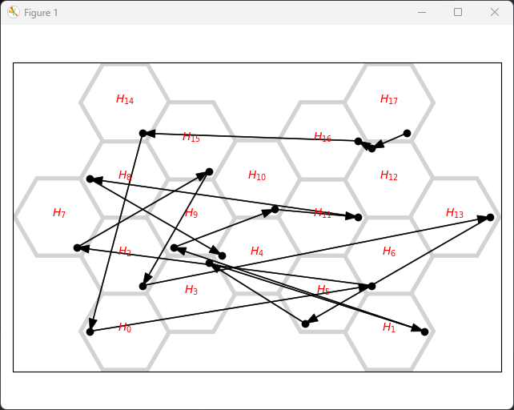
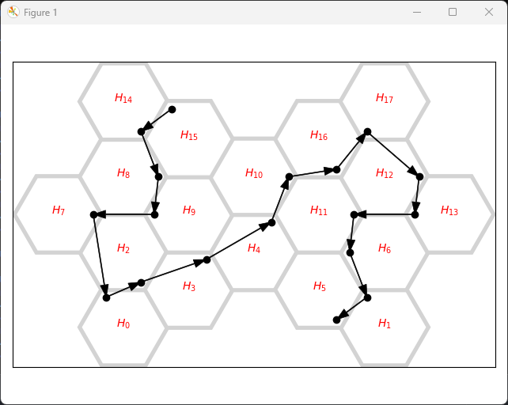
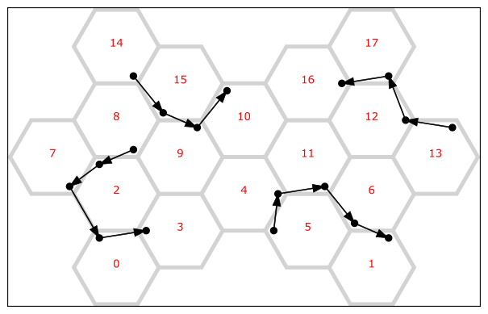
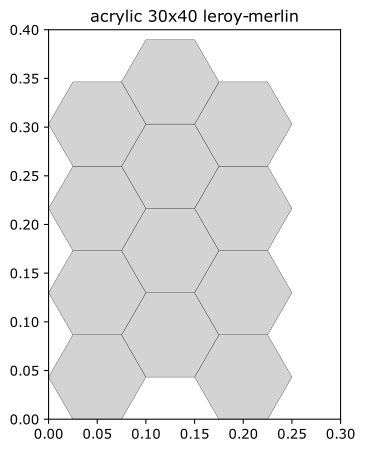
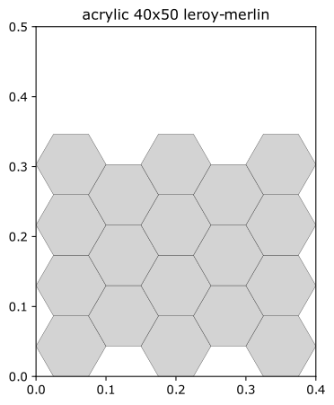
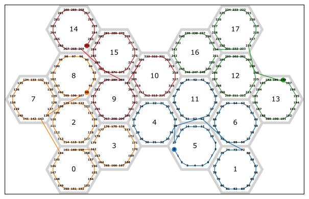
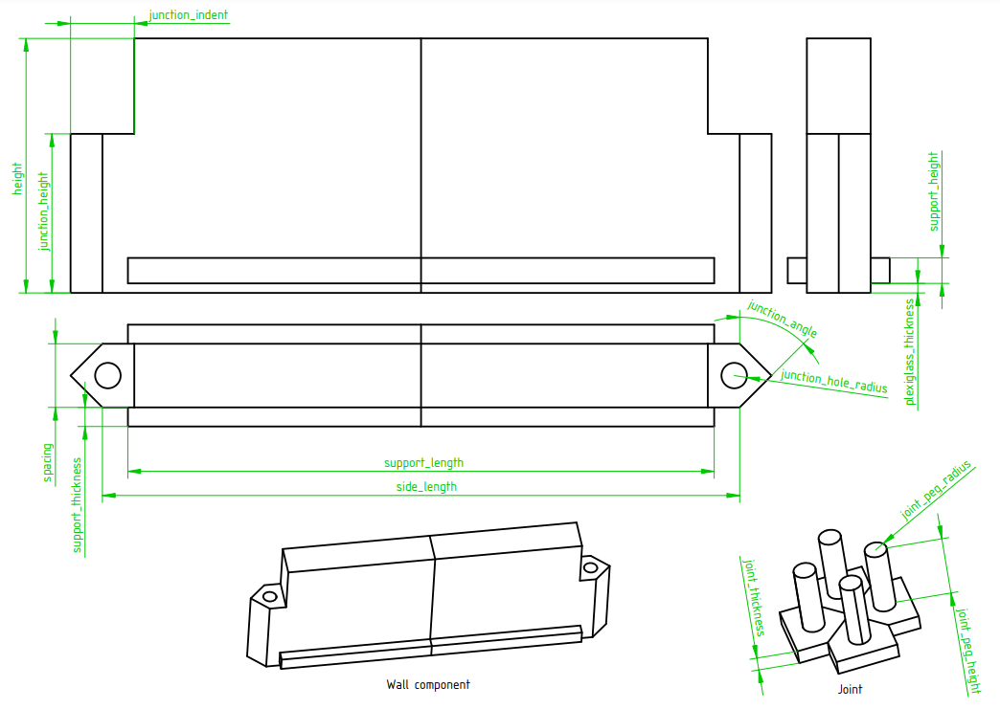
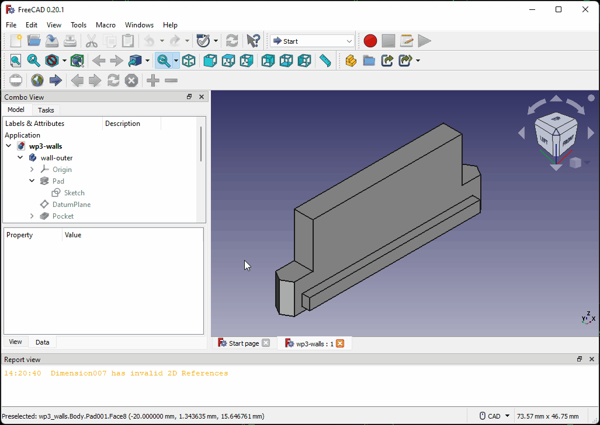

**TODO**

- Fix this README
- Explain the bug in YAML when using scientific notation
- CAD: allow to change the angle depending on the type of panel.
- Explain how to use the panels in SignalRGB using a [raspberry](https://srgbmods.net/picoled/)

**TABLE OF CONTENTS**

<!-- TOC depthFrom:1 depthTo:6 withLinks:1 updateOnSave:1 orderedList:0 -->

- [WP3: Wilson's Pew-Pew Panels](#wp3-wilsons-pew-pew-panels)
- [Software dependencies](#software-dependencies)
	- [FreeCAD](#freecad)
	- [Python / Anaconda](#python-anaconda)
- [Designing the panels](#designing-the-panels)
	- [Launching the designer](#launching-the-designer)
		- [Using the `wp3_designer.exe` executable](#using-the-wp3designerexe-executable)
		- [Launching `wp3_designer.py` from the command line](#launching-wp3designerpy-from-the-command-line)
	- [`wp3_designer`: quick overview](#wp3designer-quick-overview)
		- [Choosing panel locations](#choosing-panel-locations)
		- [Routing](#routing)
		- [Materials and result files](#materials-and-result-files)
			- [Filling and choosing sheets](#filling-and-choosing-sheets)
			- [Choosing LED strips](#choosing-led-strips)
			- [Routing schemes](#routing-schemes)
			- [Bill of materials](#bill-of-materials)
	- [Configuration of the designer](#configuration-of-the-designer)
		- [Panels settings](#panels-settings)
		- [Routing settings](#routing-settings)
		- [Materials settings](#materials-settings)
		- [Assembly settings](#assembly-settings)
	- [Updating the CAD](#updating-the-cad)
- [Building the panels](#building-the-panels)
	- [Purchasing the components](#purchasing-the-components)
	- [3D-printing the walls](#3d-printing-the-walls)
	- [Assembling the panels](#assembling-the-panels)
	- [SignalRGB integration](#signalrgb-integration)
		- [Preparing the Pico controller](#preparing-the-pico-controller)
		- [Adding the panels into SignalRGB's layouts](#adding-the-panels-into-signalrgbs-layouts)

<!-- /TOC -->

# WP3: Wilson's Pew-Pew Panels

This project provides the instructions to create a custom design of A-RGB panels. The repository includes a python script (`wp3_designer.py`) that allows to design a custom composition of panels and then outputs several files to help manufacturing the panels. A parametric CAD file (that can be edited in [FreeCAD](https://www.freecadweb.org/)) allows to quickly generate STL files with appropriate dimensions to 3D print the edges of the panels.

In my original vision, these panels are meant to be used with [SignalRGB](https://www.signalrgb.com/) - which is why I included a special section dedicated to using them in the software. However, these panels are nothing but a fancy set of A-RGB strips: you can of course connect them to any hardware that is able to control NeoPixel/WS2812 LEDs!

# Software dependencies

## FreeCAD

| Note: This software is used to export CAD files to be printed in 3D. If you are planning to create the supporting walls in a different way, e.g., using cardboard, you can skip this. |
| --- |

Installing the program should be very easy: just head to the [FreeCAD download page](https://www.freecadweb.org/downloads.php) and download the installer. Launch it and install the software.

## Python / Anaconda

| Note: this is an optional dependency that is required only if you run the script from its source. You can otherwise just run the "compiled" script (see the section **ADD LINK TO THE SECTION HERE**). |
| --- |

The `wp3_designer.py` script requires a valid Python installation with very few additional packages. If you know how to use Python already, just make sure that the packages `Matplotlib`, `NumPy` and `PyYAML` are installed and skip to the next section. If you do not know how to install Python, or you are not entirely sure, in the following there is a quick and simple way based on [Anaconda](https://www.anaconda.com/). These steps have been tested in Windows, but they should be very similar under Ubuntu and MacOS. In addition, if you know how to use `pip`, you can do pretty much the same by `pip install`ing the required packages from a terminal, without using Anaconda at all. As best practice, make sure to use `venv` or `virtualenv` to create a virtual environment to contain the packages and not mess with your local installation.

Anyway, here are the instructions to download all Python dependencies:

1. Download the installer from the [Anaconda Distribution](https://www.anaconda.com/products/distribution) page.
1. Install Anaconda by following the wizard. The default options should be fine.
1. Launch Anaconda Navigator and on the left select *Environments*.
1. You should see a pre-installed environment, named *base (root)*. In the bottom, you should be able to create a new environment by clicking on the *create* button (featuring a "+" icon).
1. Give a name to the environment, e.g., *wp3*.
1. Make sure that, next to the label *Packages*, *Python* is checked while *R* is unchecked. You should be able to select a Python version. I recommend using `3.9.XX` since is the one I used, but do as you please.
1. Click on *Create* and wait for the environment to be ready.
1. You should see a list of packages that are already installed. On the top, switch from the option *Installed* to *All*.
1. On the top-right, there should be a package search bar. Click inside it and type `numpy`. In the list, look for the package named `numpy` and select it. Go back to the search bar and type `matplotlib`, then select `matplotlib` from the package list. Do the same a third time to locate and select the package `pyyaml`. Note that there might also be a `pyaml` package, with a single `y`. Do not select this one! To recap: `pyyaml` good, `pyaml` bad.
1. In the bottom right corner you should see a green button showing the text *Apply*: click on it. Anaconda will then open a pop-up window asking to install several packages. Click on *Apply* to install the three selected packages and their dependencies. This might take a while, just be patient and wait.

Python is now configured! You can close the Anaconda navigator and proceed to the next step.

# Designing the panels

The design pipeline is quite simple: you firstly launch the script `wp3_designer.py` (or its executable equivalent, `wp3_designer.exe`), which allows to create a custom design for a set of hexagonal panels. Once the design is ready, the script provides some information about the material to be purchased and few "instructions" to manufacture the panels. You then have to adapt the CAD files and export STL meshes for 3D printing.

## Launching the designer

To start the designer, you have two options:

- Using the "compiled" version of the script, `wp3_designer.exe`. This is recommended if you are new to Python and/or not willing to install it.
- Running the script itself from a terminal. This might be interesting if you plan to modify the script at some point.

### Using the `wp3_designer.exe` executable

First of all, download the archive [wp3_designer.zip](https://github.com/francofusco/wp3/releases/latest/download/wp3_designer.zip), which contains two files: the executable `wp3_designer.exe` and a YAML configuration file. Extract them in a location of your choice and then double click on the executable. It will take a moment for the program to start, but that should be all!

If you wish to use an older version, check the [releases page](https://github.com/francofusco/wp3/releases) and download the `wp3_designer.zip` from the corresponding assets.

### Launching `wp3_designer.py` from the command line

If you already used Python before, this should sound very familiar. If you did not, I hope the procedure is clear and detailed enough to make it easy and painless. Anyway, here is what you need to do:

1. [Download the repository](https://github.com/francofusco/wp3/archive/refs/heads/main.zip), if you haven't done that already. If you downloaded the source code using this link, make sure to extract the content of the archive in a location of your choice!
1. Open Anaconda Navigator and on the left, select *Environments*.
1. Select the environment that you previously created (see [Python / Anaconda](#python-anaconda)).
1. Once it has been activated, click on the green button with the "play" icon, next to the environment name.
1. Select the option *Open Terminal* (it should be the first one).
1. A command prompt should open. Go to the location where you stored the source code using the `cd` command followed by the path to the directory that contains it. The command might look like `cd C:\Users\username\Documents\wp3`.
1. Now type `python wp3_designer.py`.

## `wp3_designer`: quick overview

### Choosing panel locations

After launching the designer, a window should open, that looks like the following:

This is the design window, that allows you to create a custom composition of panels that you will later build. To change the composition, you can do the following:

- Click anywhere within the design space to add or remove a hexagon.
- Press `A` to remove all hexagons, `CTRL+A` to fill the space with as many hexagons as possible.
- Press the space bar to toggle all hexagons. As an example, if you press the space bar right after startup you should see the following:

Once you are satisfied with a design, just close the window.

### Routing

The program will now start a routing step, in which it tries to determine a nice placement for the cables, so that you do not need an exaggerate amount of wire and the back of the panels does not become a tangled mess. In particular, the panels are designed so that a short LED strip can be glued in their inside and connectors can be soldered at the extremities of a strip to provide power and carry the signal. The connectors are positioned in one of the vertices of the polygonal shapes. To provide power and control all LEDs, it is necessary to connect all panels in sequence.

A very simple optimization algorithm has been developed to automate (at least partially) the routing process. Its task is to select, for each tile, one vertex where connectors are to be placed and then to choose the order in which tiles are visited. It will try to do so while keeping into account the following criteria:

- Two adjacent panels should not use the same vertex for their connectors;
- The order of visit should minimize the total travelled distance.

The routing process starts with a random path of wire from one panel to the other. This is generally a **very** bad solution:

As you can see, the routing path is a mess here. Not only we jump all over the place, but some vertices feature multiple connectors. As an example, the tiles labelled *H12* and *H16* have their connectors in the same place, which is undesirable. A better path would be like the following:

To let the algorithm do its job, you can press the space bar. The current window will close and progress feedback will be shown in the active console. It takes a while, but the first run makes a huge difference. You can also interrupt the optimization at any time by pressing CTRL+C. After the routing has been optimized, it is shown again for validation. Do not expect incredible results: the algorithm is very simple and sometimes it struggles to find nice solutions. To overcome its limitation, you might have to repeat the process more than once (just hit the space bar again). Beware that sometimes the algorithm will not be able to improve the current routing. This does not necessarily mean that there is no better solution, but just that the optimization did not find one. Be patient, and try as many times as needed. Another way to make the problem easier is to let the algorithm break the routing path into multiple segments (this is explained later, in [Routing settings](#routing-settings)):

Once you are satisfied with the obtained routing, you can close the window.

### Materials and result files

The program will now generate a couple of files that detail what components are needed and in which quantity to create the custom design. Most of the remaining steps rely on a list of available materials that you can specify in `config.yaml`, as detailed later in [Materials settings](#materials-settings). For now, you just need to know that there are two classes of materials used by the designer:

- *Sheets* are all materials that can be used to manufacture the fronts of the panels. As an example, I decided to use acrylic (which is transparent) to have a rigid surface and I glued an opaque film on top of it to better diffuse the light. Both materials can be purchased in sheets of given size and we need to cut tiles out of them.
- *LEDs*, organized in strips, are, well, LED strips. They come with a given amount of LEDs and density (LEDs per meter).

All materials have an associated cost, and one of the goals of the designer is to tell you how much of every material you need to buy to be able to create the panels while spending as little as possible.

#### Filling and choosing sheets

Each material that falls in the sheet category is characterized by a size. One of the jobs of the designer is to figure out how many tiles can be inserted in these sheets, and how. For each material, a pdf document is produced under the name `design_info/tiling_<sheet-name>.pdf` that shows how tiles can fit in the sheet.

As an example, there is a store near my house that sells acrylic sheets in a number of fixed sizes, such as 30x40cm2 and 40x50cm2. If my goal was to create the design shown in [Choosing panel locations](#choosing-panel-locations), which uses hexagonal panels with a side length of 5cm, this is how the two sheets would be filled:

Note that sheets do not always come in a predetermined size. Sometimes, they have a fixed width only, and you can buy as much material as you want, with the price increasing linearly with the chosen length. The designer is able to deal with this type of product as well, calculating the required amount of material in addition to finding how to fit tiles inside it.

Once all sheets have been processed in this way, it is time for the designer to figure out how much of every material should be bought. Once again, let's consider the design in [Choosing panel locations](#choosing-panel-locations), which includes 18 tiles in total. Using the two sheets above, there are two options: either buy two 30x40cm2 sheets or a single 40x50cm2 one. The choice, of course, depends on the cost. Even though the calculation is trivial, repeating it every time you change your design and making sure that you take into account all possible combinations can be error prone. For this reason, the designer does this job for you! Your only task is to specify which materials should be used, as described more in details in the section [Assembly settings](#assembly-settings).

#### Choosing LED strips

One further task of the designer is to choose how many LED strips should be purchased, which depends mainly on the size and amount of the tiles. Multiple LED strips might be available for purchase, with different lengths and LED densities. Similarly to what is done with sheets, the designer evaluates the appropriate amount of strips of each type to be purchased to satisfy the design requirements.

Let's clarify with an example, assuming the following specs:

- The design uses 18 triangular panels with a 8cm side
- We can purchase LED strips in the following varieties:
	- 60 LEDs per meter, in two variants: 1m strips and 5m strips
	- 30 LEDs per meter, in a single 1m variant

The problem is, how many 60-LEDs-per-meter strips should be buy, and which? And if we wanted to use 30-LEDs-per-meter strips instead?

Let's think about the first problem. The total perimeter of each tile is 24cm and you would therefore be able to fit at most 60 x 0.3 = 14.4 LEDs in each panel. Since a fraction of a LED cannot be put inside a panel, you will have to put 14 LEDs in each tile, corresponding to 14 / 60 = 0.233 meters of strip per tile. If you had to fill 18 panels, you would need a total of 4.2 meters of LEDs. There would be two purchase options then: either buy 5 1m strips or a single 5m one. Once again, the choice depends on the prices. And what about the 30-LEDs-per-meter strips? No need to perform calculations manually: the designer will once again do it for us.

#### Routing schemes

Another feature of the designer is that it is able to provide a detailed routing scheme to correctly address all LEDs in the design. In particular, given the optimal routing found before (see [Routing](#routing)), for each LED density in the available strips the designer will produce a scheme that looks like the following:

This scheme allows to locate each LED individually in the custom design. Furthermore, a JSON file is produced that can be imported into SignalRGB to provide the necessary information to map each LED to a portion of the scene.

For each given LED density, the routing scheme and the JSON file are generated respectively under the names `design_info/wp3_routing_XXX_leds_per_tile.pdf` and  `design_info/wp3_signal_rgb_XXX_leds_per_tile.json`, where `XXX` is the number of LEDs that the designer determined can fit in a single panel.

#### Bill of materials

Last but not least, the designer produces a file, `design_info/bill_of_materials.md`, that summarizes the type and number of items that need to be purchased. It should include the following information:

- Number of parts that have to be 3D printed (with the list of parameters that have to be updated in the CAD).
- Calculate how many sheets of each kind should be purchased.
- Evaluate how many LED strips are to be purchased and estimate the required wattage (in a worst-case scenario).
- Count how many connectors are needed.

## Configuration of the designer

Describe how to change the parameters in `config.yaml`.

Note about scientific notation in PyYAML (bug that requires the format `1.0e-2` instead of `1e-2`).

### Panels settings

Grouped under `panels`.

| Parameter | Type | Description |
| :-------: | :--: | ----------- |
| `rows` | `int` | Number of rows in the designer area. |
| `columns`| `int` | Number of columns in the designer area. |
| `side_length` | `float` | Length of a hexagonal tile, in meters. |
| `spacing` | `float` | Distance between the sides of two adjacent hexagonal tiles, in meters. |
| `vertical_stacking` | `bool` | Orientation of the hexagonal tiles. If `True`, then the hexagons are flat on the top and bottom, and pointy on the right and left. If `False`, it is the opposite. |
| `initial_tiling` | `array` | This parameter allows to load a custom design on startup. After generating a composition of panels, the designer will print in the console an array to be copied verbatim in this parameter. The array is just a list of row-column pairs corresponding to hexagons that should be visible on launch. |

### Routing settings

Grouped under `routing`.

| Parameter | Type | Description |
| :-------: | :--: | ----------- |
| `max_attempts`| `int` | Number of columns in the designer area. |
| `improvement_steps` | `float` | Length of a hexagonal tile, in meters. |
| `cache` | `int` | Number of rows in the designer area. |

### Materials settings

Grouped under `materials/leds/strip_name`. Each entry should have:

| Parameter | Type | Description |
| :-------: | :--: | ----------- |
| `number_of_leds` | `int` | Number of LEDs in the strip. |
| `leds_per_meter`| `int` or `float` | LEDs per meter in the strip. |
| `watts` | `float` | Optional. Power consumption of the strip. |
| `cost` | `float` | Optional. Cost of the strip. |
| `url` | `str` | Optional. Link to purchase the strip. |

Grouped under `materials/sheets/sheet_name`. Each entry should have:

| Parameter | Type | Description |
| :-------: | :--: | ----------- |
| `size` | `[float, float]` | Width and height/length of the sheet. If a sheet is sold with variable height/length, you can replace it with `inf` and the designer will select an appropriate size. |
| `cost` | `float` | Optional. Cost of the sheet. If the height/length of the sheet is `inf`, then the cost is assumed to be per unit of length. |

### Assembly settings

Explain the entries under `assembly/leds` and `assembly/sheets`.

## Updating the CAD

The provided CAD file is parametric, meaning that you can change some values and the whole design will be updated accordingly. There are two types of component to be printed: *inner walls* (sides shared by two panels) and *outer walls* (sides belonging to a unique hexagon). The difference is that inner walls have a small support for the acrylic panels on both sides, while outer walls have this support on one side only. Here is a sketch of an outer wall:

Green measures represent parameters that can be changed in FreeCAD to customize the component. In principle, you should just update the parameters *Side Length* and *Spacing* to reflect the choices you made for your panels, but you can play around with the others as well if you want to.

Whatever your decision, to update the CAD start by opening the file `cad/wall.FCStd` in FreeCAD. Now, follow these steps:

1. On the left, you should be able to locate a spreadsheet named *parameters*. Double click on it to open the spreadsheet view.
1. You can now change the parameters as needed. As mentioned, you probably just need to update *Side Length* and *Spacing* (and perhaps *Plexiglass Thickness* depending on the plexiglass sheets that you are going to purchase).
1. Back in the combo view (the menu on the left), select the object named *inner-wall* by double clicking on it.
1. Go to *File/Export* and select *STL Mesh (\*.stl)* as file type. Give it the name *inner-wall.stl* and export it.
1. Do the same with the *outer-wall* body, exporting as *outer-wall.stl*.

If you wish to change something more than length and width of the walls, just keep in mind the following:

- Dimensions are in millimeters since this is a popular standard in CAD software - and also in the 3D printing community.
- The parameter *Panel Support Lateral Play* should likely be kept unchanged. It is used to shrink the panel support bar to avoid issues when assembling the panels. If you want, you can increase it a little and see what it does.
- The parameter *Junction Indentation* should be strictly between zero and half of the side length. It should not be too large, to allow enough stability and support, but also not to small, to let multiple wires pass through it.
- *Panel Support Height* should be smaller than *Junction Height* minus *Plexiglass Thickness*.
- The LED strip should be glued on the lower part of the wall: make sure there is enough space for it!

# Building the panels

## Purchasing the components

## 3D-printing the walls

## Assembling the panels

## SignalRGB integration

### Preparing the Pico controller

### Adding the panels into SignalRGB's layouts
