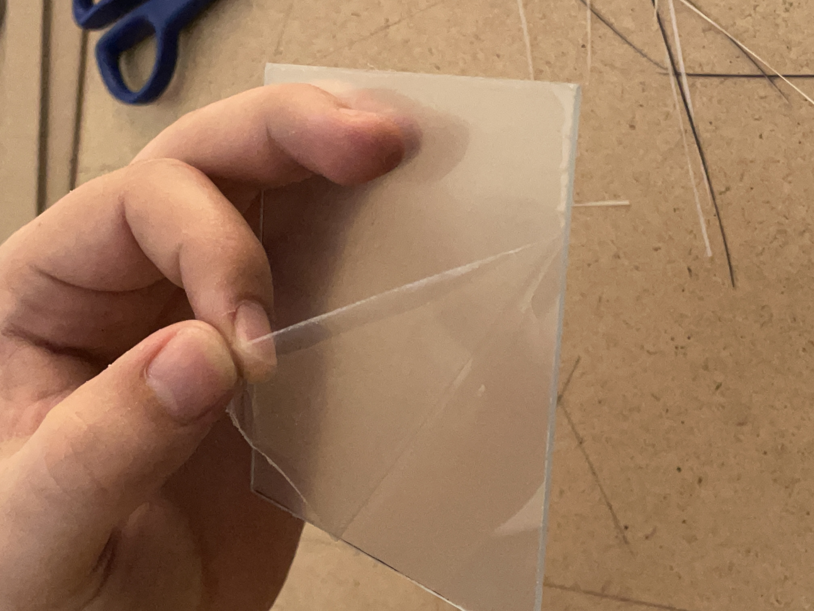

[](https://github.com/psf/black)
[](https://github.com/francofusco/wp3/actions/workflows/formatting.yml)

**TABLE OF CONTENTS**

<!-- TOC depthFrom:1 depthTo:6 withLinks:1 updateOnSave:1 orderedList:0 -->

- [WP3: Wilson's Pew-Pew Panels](#wp3-wilsons-pew-pew-panels)
- [Software dependencies](#software-dependencies)
	- [FreeCAD](#freecad)
	- [Python and Anaconda](#python-and-anaconda)
- [Designing the panels](#designing-the-panels)
	- [Launching the designer](#launching-the-designer)
		- [Using the designer executable](#using-the-designer-executable)
		- [Launching the designer from the command line](#launching-the-designer-from-the-command-line)
	- [Quick overview of the designer](#quick-overview-of-the-designer)
		- [Creating and loading projects](#creating-and-loading-projects)
		- [Choosing panel locations](#choosing-panel-locations)
		- [Routing](#routing)
		- [Materials and result files](#materials-and-result-files)
			- [Filling and choosing sheets](#filling-and-choosing-sheets)
			- [Choosing LED strips](#choosing-led-strips)
			- [Routing schemes](#routing-schemes)
			- [Bill of materials](#bill-of-materials)
	- [Configuration of the designer](#configuration-of-the-designer)
		- [Panels settings](#panels-settings)
		- [Routing settings](#routing-settings)
		- [SignalRGB components settings](#signalrgb-components-settings)
		- [Materials settings](#materials-settings)
		- [Assembly settings](#assembly-settings)
- [Building the panels](#building-the-panels)
	- [Purchasing the components](#purchasing-the-components)
	- [Updating the CAD and 3D-printing the walls](#updating-the-cad-and-3d-printing-the-walls)
	- [Walls made out of cardboard as a cheap alternative](#walls-made-out-of-cardboard-as-a-cheap-alternative)
	- [Assembling the panels](#assembling-the-panels)
	- [SignalRGB integration](#signalrgb-integration)
		- [Preparing the Pico controller](#preparing-the-pico-controller)
		- [Adding the panels into SignalRGB's layouts](#adding-the-panels-into-signalrgbs-layouts)
- [Contributing and reporting issues](#contributing-and-reporting-issues)
	- [Troubleshooting](#troubleshooting)
	- [Instructions for developers](#instructions-for-developers)

<!-- /TOC -->


# WP3: Wilson's Pew-Pew Panels

This project provides the instructions to create a custom design of A-RGB panels. The repository includes a python script (`wp3_designer.py`) that allows to design a custom composition of panels and then outputs several files to help manufacturing the panels. A parametric CAD file (that can be edited in [FreeCAD](https://www.freecadweb.org/)) allows to quickly generate STL files with appropriate dimensions to 3D print the edges of the panels.

In my original vision, these panels are meant to be used with [SignalRGB](https://www.signalrgb.com/) - which is why I included a special section dedicated to using them in the software. However, these panels are nothing but a fancy set of A-RGB strips: you can of course connect them to any hardware that is able to control NeoPixel/WS2812 LEDs!

<p align="center">

</p>

| The question that probably nobody asked: why *Wilson's Pew-Pew Panels*? Well, *Wilson* is the name I gave to my PC while *Pew-Pew* is the sound that my girlfriend used to do to describe the lighting effects of my tower build. Hence, the name was born! :computer::sparkles::sparkles: |
| :-- |


# Software dependencies

## FreeCAD

| :warning: I do not own a 3D printer and therefore I have not tried printing the provided 3D models yet. I will probably need to update them once I manage to find a 3D printer and build a couple of panels. |
| :-- |

| :information_source: This software is used to export CAD files to be printed in 3D. If you are planning to create the supporting walls in a different way, e.g., using cardboard, you can skip this. |
| :-- |

Installing the program should be very easy: just head to the [FreeCAD download page](https://www.freecadweb.org/downloads.php) and download the installer. Launch it and install the software.


## Python and Anaconda

| :information_source: this is an optional dependency that is required only if you run the script from its source. You can otherwise just run the "compiled" script (see the section [Using the designer executable](#using-the-designer-executable)). |
| :-- |

The `wp3_designer.py` script requires a valid Python installation with very few additional packages. If you know how to use Python already, just make sure that the packages `Matplotlib`, `NumPy` and `PyYAML` are installed and skip to the next section. If you do not know how to install Python, or you are not entirely sure, in the following there is a quick and simple way based on [Anaconda](https://www.anaconda.com/). These steps have been tested in Windows, but they should be very similar under Ubuntu and MacOS. In addition, if you know how to use `pip`, you can do pretty much the same by `pip install`ing the required packages from a terminal, without using Anaconda at all. As best practice, make sure to use `venv` or `virtualenv` to create a virtual environment to contain the packages and not mess with your local installation.

Anyway, here are the instructions to download all Python dependencies:

1. Download the installer from the [Anaconda Distribution](https://www.anaconda.com/products/distribution) page.
1. Install Anaconda by following the wizard. The default options should be fine.
1. Launch Anaconda Navigator and on the left select *Environments*.
1. You should see a pre-installed environment, named *base (root)*. In the bottom, you should be able to create a new environment by clicking on the *create* button (featuring a "+" icon).
1. Give a name to the environment, e.g., *wp3*.
1. Make sure that, next to the label *Packages*, *Python* is checked while *R* is unchecked. You should be able to select a Python version. I recommend using `3.9.XX` since is the one I used, but do as you please.
1. Click on *Create* and wait for the environment to be ready.
1. You should see a list of packages that are already installed. On the top, switch from the option *Installed* to *All*.
1. On the top-right, there should be a package search bar. Click inside it and type `numpy`. In the list, look for the package named `numpy` and select it. Go back to the search bar and type `matplotlib`, then select `matplotlib` from the package list. Do the same a third time to locate and select the package `ruamel.yaml`.
1. In the bottom right corner you should see a green button showing the text *Apply*: click on it. Anaconda will then open a pop-up window asking to install several packages. Click on *Apply* to install the three selected packages and their dependencies. This might take a while, just be patient and wait.


| :warning: The gif is not up to date and installs `PyYAML` instead of `ruamel.yaml`. Make sure to select the latter, not the former! |
| --- |

Python is now configured! You can close the Anaconda navigator and proceed to the next step.


# Designing the panels

The design pipeline is quite simple: you firstly launch the script `wp3_designer.py` (or its executable equivalent, `wp3_designer.exe`), which allows to create a custom design for a set of panels. Once the design is ready, the script provides some information about the material to be purchased and few "instructions" to manufacture the panels. You then have to adapt the CAD files and export STL meshes for 3D printing.


## Launching the designer

To start the designer, you have two options:

- Using the "compiled" version of the script, `wp3_designer.exe`. This is recommended if you are new to Python and/or not willing to install it.
- Running the script itself from a terminal. This might be interesting if you plan to modify the script at some point.


### Using the designer executable

Download the executable [wp3_designer.exe](https://github.com/francofusco/wp3/releases/latest/download/wp3_designer.exe), place it in a location of your choice and then double click on it. It will take a moment for the program to start, but that should be all!

If you wish to use an older version, check the [releases page](https://github.com/francofusco/wp3/releases) and download the executable from the corresponding assets.


### Launching the designer from the command line

If you already used Python before, this should sound very familiar. If you did not, I hope the procedure is clear and detailed enough to make it easy and painless. Anyway, here is what you need to do:

1. [Download the repository](https://github.com/francofusco/wp3/archive/refs/heads/main.zip), if you haven't done that already. If you downloaded the source code using this link, make sure to extract the content of the archive in a location of your choice! You can also do it from the command line via `git clone git@github.com:francofusco/wp3.git` (ssh) or `git clone https://github.com/francofusco/wp3.git` (https).
1. Open Anaconda Navigator and on the left, select *Environments*.
1. Select the environment that you previously created (see [Python and Anaconda](#python-and-anaconda)).
1. Once it has been activated, click on the green button with the "play" icon, next to the environment name.
1. Select the option *Open Terminal* (it should be the first one).
1. A command prompt should open. Go to the location where you stored the source code using the `cd` command followed by the path to the directory that contains it. The command might look like `cd C:\Users\username\Documents\wp3`.
1. Now type `python wp3_designer.py`.


## Quick overview of the designer


### Creating and loading projects

After launching the designer, a dialog window should open, asking to create a new project or load an existing one.

If you choose to create a new one, enter its name and change the default parameters if you wish (more details about their meaning are provided in the section [Configuration of the designer](#configuration-of-the-designer)). The project will be stored inside a folder with the given project name and a configuration file, named `config.yaml` will be created.

If you wish to load an existing project, move to the folder that contains it and select its `config.yaml` file.


### Choosing panel locations

When working on a project, a window should open that looks like the following:


This is the design window, that allows you to create a custom composition of panels that you will later build. To change the composition, you can do the following:

- Click anywhere within the design space to add or remove a tile.
- Press `A` to remove all tiles, `CTRL+A` to fill the space with as many tiles as possible.
- Press the space bar to toggle all tiles.

Once you are satisfied with a design, just close the window.


### Routing

The program will now start a routing step, in which it tries to determine a nice placement for the cables, so that you do not need an exaggerate amount of wire and the back of the panels does not become a tangled mess. In particular, the panels are designed so that a short LED strip can be glued in their inside and connectors can be soldered at the extremities of a strip to provide power and carry the signal. The connectors are positioned in one of the vertices of the polygonal shapes. To provide power and control all LEDs, it is necessary to connect all panels in sequence.

A very simple optimization algorithm has been developed to automate (at least partially) the routing process. Its task is to select, for each tile, one vertex where connectors are to be placed and then to choose the order in which tiles are visited. It will try to do so while keeping into account the following criteria:

- Two adjacent panels should not use the same vertex for their connectors;
- The order of visit should minimize the total travelled distance.

The routing process starts with a random path of wire from one panel to the other. This is generally a **very** bad solution:


As you can see, the routing path is a mess here. Not only we jump all over the place, but some vertices feature multiple connectors. As an example, the tiles labelled *H12* and *H16* have their connectors in the same place, which is undesirable. A better path would be like the following:


To let the algorithm do its job, you can press the space bar. The current window will close and progress feedback will be shown in the active console. It takes a while, but the first run makes a huge difference. You can also interrupt the optimization at any time by pressing CTRL+C. After the routing has been optimized, it is shown again for validation. Do not expect incredible results: the algorithm is very simple and sometimes it struggles to find nice solutions. To overcome its limitation, you might have to repeat the process more than once (just hit the space bar again). Beware that sometimes the algorithm will not be able to improve the current routing. This does not necessarily mean that there is no better solution, but just that the optimization did not find one. Be patient, and try as many times as needed. Another way to make the problem easier is to let the algorithm break the routing path into multiple segments (this is explained later, in [Routing settings](#routing-settings)):


Once you are satisfied with the obtained routing, you can close the window.


### Materials and result files

The program will now generate a couple of files that detail what components are needed and in which quantity to create the custom design. Most of the remaining steps rely on a list of available materials that you can specify in `config.yaml`, as detailed later in [Materials settings](#materials-settings). For now, you just need to know that there are two classes of materials used by the designer:

- *Sheets* are all materials that can be used to manufacture the fronts of the panels. As an example, I decided to use acrylic (which is transparent) to have a rigid surface and I glued an opaque film on top of it to better diffuse the light. Both materials can be purchased in sheets of given size and we need to cut tiles out of them.
- *LEDs*, organized in strips, are, well, LED strips. They come with a given amount of LEDs and density (LEDs per meter).

All materials have an associated cost, and one of the goals of the designer is to tell you how much of every material you need to buy to be able to create the panels while spending as little as possible.


#### Filling and choosing sheets

Each material that falls in the sheet category is characterized by a size. One of the jobs of the designer is to figure out how many tiles can be inserted in these sheets, and how. For each material, a pdf document is produced under the name `design_info/tiling_<sheet-name>.pdf` that shows how tiles can fit in the sheet.

As an example, there is a store near my house that sells acrylic sheets in a number of fixed sizes, such as 30x40cm2 and 40x50cm2. If my goal was to create the design shown in [Choosing panel locations](#choosing-panel-locations), which uses hexagonal panels with a side length of 5cm, this is how the two sheets would be filled:

<p align="center">


</p>

Note that sheets do not always come in a predetermined size. Sometimes, they have a fixed width only, and you can buy as much material as you want, with the price increasing linearly with the chosen length. The designer is able to deal with this type of product as well, calculating the required amount of material in addition to finding how to fit tiles inside it.

Once all sheets have been processed in this way, it is time for the designer to figure out how much of every material should be bought. Once again, let's consider the design in [Choosing panel locations](#choosing-panel-locations), which includes 18 tiles in total. Using the two sheets above, there are two options: either buy two 30x40cm2 sheets or a single 40x50cm2 one. The choice, of course, depends on the cost. Even though the calculation is trivial, repeating it every time you change your design and making sure that you take into account all possible combinations can be error prone. For this reason, the designer does this job for you! Your only task is to specify which materials should be used, as described more in details in the section [Assembly settings](#assembly-settings).


#### Choosing LED strips

One further task of the designer is to choose how many LED strips should be purchased, which depends mainly on the size and amount of the tiles. Multiple LED strips might be available for purchase, with different lengths and LED densities. Similarly to what is done with sheets, the designer evaluates the appropriate amount of strips of each type to be purchased to satisfy the design requirements.

Let's clarify with an example, assuming the following specs:

- The design uses 18 triangular panels with a 8cm side
- We can purchase LED strips in the following varieties:
	- 60 LEDs per meter, in two variants: 1m strips and 5m strips
	- 30 LEDs per meter, in a single 1m variant

The problem is, how many 60-LEDs-per-meter strips should be buy, and which? And if we wanted to use 30-LEDs-per-meter strips instead?

Let's think about the first problem. The total perimeter of each tile is 24cm and you would therefore be able to fit at most 60 x 0.3 = 14.4 LEDs in each panel. Since a fraction of a LED cannot be put inside a panel, you will have to put 14 LEDs in each tile, corresponding to 14 / 60 = 0.233 meters of strip per tile. If you had to fill 18 panels, you would need a total of 4.2 meters of LEDs. There would be two purchase options then: either buy 5 1m strips or a single 5m one. Once again, the choice depends on the prices. And what about the 30-LEDs-per-meter strips? No need to perform calculations manually: the designer will once again do it for us.


#### Routing schemes

Another feature of the designer is that it is able to provide a detailed routing scheme to correctly address all LEDs in the design. In particular, given the optimal routing found before (see [Routing](#routing)), for each LED density in the available strips the designer will produce a scheme that looks like the following:


This scheme allows to locate each LED individually in the custom design. Furthermore, JSON files are produced that can be imported into SignalRGB to provide the necessary information to map each LED to a portion of the scene. Four components are generated: one that closely resembles the detailed routing scheme, one that puts all LEDs belonging to a tile in its center (in this way, each tile has a uniform color), one that represent a single tile with LEDs on its border and one that represents a single tile, with LEDs in its center.

For each given LED density, the routing scheme and the JSON files are generated respectively under the names `design_info/wp3_routing_XXX_leds_per_tile.pdf` and  `design_info/wp3_signal_rgb_PROJECT-NAME_XXX_leds[VARIANT].json`, where `XXX` is the number of LEDs that the designer determined can fit in a single panel, `PROJECT-NAME` is, well, the name of the project and `[VARIANT]` is a string that depends on the type of exported component.


#### Bill of materials

Last but not least, the designer produces a file, `design_info/bill_of_materials.md`, that summarizes the type and number of items that need to be purchased. It should include the following information:

- Number of parts that have to be 3D printed (with the list of parameters that have to be updated in the CAD).
- Calculate how many sheets of each kind should be purchased.
- Evaluate how many LED strips are to be purchased and estimate the required wattage (in a worst-case scenario).
- Count how many connectors are needed.


## Configuration of the designer

The designer can be customized by editing the YAML configuration file `config.yaml` present inside each project.

If you are unfamiliar with YAML, have a look at the [Wikipedia page](https://en.wikipedia.org/wiki/YAML) or just do a web search.

| :information_source: There is a bug in PyYAML related to scientific notation. If you want to write a number such as `0.01`, you might want to write it as `1e-2`. However, due to the bug you must include the decimal point in the base: `1.0e-2`. |
| :-- |


### Panels settings

Grouped under `panels`.

| Parameter | Type | Description |
| :-------: | :--: | ----------- |
| `type` | `str` | Type of each tile. It should correspond to the name of one of the `Tile` subclasses (`Triangle`, `Rectangle` or `Hexagon`). Optionally, the name can be followed by a `#` and an integer that identifies the variant of the tile. As an example, you might write `type: Hexagon#1` or `type: Triangle` (which is equivalent to `type: Triangle#0`). |
| `rows` | `int` | Number of rows in the designer area. |
| `columns`| `int` | Number of columns in the designer area. |
| `side_length` | `float` | Lateral size of the tiles, in meters. |
| `spacing` | `float` | Distance between the sides of two adjacent tiles, in meters. |
| `initial_tiling` | `array` | Optional. This parameter allows to load a custom design on startup. The array is just a list of row-column pairs corresponding to tiles that should be visible on launch. After generating a composition of panels, the designer automatically updates the configuration file by storing the array corresponding to the current design. Therefore, you should not need to edit this parameter manually. |


### Routing settings

Grouped under `routing`.

| Parameter | Type | Description |
| :-------: | :--: | ----------- |
| `segments` | `int` | Optional. Number of segments to be used in the routing procedure. Cannot be given if `tiles_per_segment` is specified. |
| `tiles_per_segment` | `int` | Optional. Allows to use multiple segments in the routing, by specifying the maximum number of tiles to be traversed in each segment. Cannot be given if `segments` is specified. |
| `cache` | `array` | Optional. This parameter allows to load on startup a routing that was found in a previous run, rather than starting from a random guess. The array contains two lists: the first one being the indices of the traversed tiles and the second one telling on which vertex of each tile a connector is placed. Every time a routing is determined, the designer updates the configuration file by storing the array corresponding to the current routing. Therefore, you should not need to edit this parameter manually. |
| `max_iterations`| `int` | Optional. The routing algorithm works by generating random samples and trying to improve them. This parameter decides how many samples to generate in total. |
| `attemps_per_improvement`| `int` | Optional. The routing algorithm works by generating random samples and trying to improve them by random mutations. This parameter decides how many unsuccessful mutations can be attempted before considering a random sample as improved. |
| `random_start_probability`| `float` | Optional. When generating candidates for improvement, the algorithm will either create a random sample or select the current optimal solution and try again to improve it with more random mutations. This parameter provides the probability of generating random samples instead of selecting the current best. You should probably give it a value between `0.9` and `1.0`. |
| `max_swap_distance`| `int` | Optional. One of the possible mutations that is generated consist in swapping the order we visit two tiles. This parameter tells how farther the tiles can be. |
| `mixed_mutations`| `int` | Optional. The algorithm performs mutations by selecting a tile and performing two distinct types of alterations: (1) swap its order of visit with all tiles within `max_swap_distance` and (2) change the vertex where its connector is located. In addition, a certain number of mixed mutations can be generated, in which both alterations are performed at the same time. Since the total amount of combinations is way too large for brute forcing, only a certain number of mixed mutations (controlled by this parameter) is selected. |


### SignalRGB components settings

Grouped under `signal_rgb`.

| Parameter | Type | Description |
| :-------: | :--: | ----------- |
| `name_prefix` | `str` | Optional. Prefix that should be used to identify the components inside SignalRGB. By default, the prefix is `WP3 PROJECT-NAME`.
| `component_size` | `int` | Optional. Maximum width and height of the component inserted in SignalRGB's canvas, when unscaled. This applies to the largest dimension, the smallest will be evaluated to maintain the correct aspect ratio. |
| `tile_size` | `int` | Optional. Maximum width and height of the single-tile component inserted in SignalRGB's canvas, when unscaled. This applies to the largest dimension, the smallest will be evaluated to maintain the correct aspect ratio. |


### Materials settings

Materials come in two types: sheets and LED strips. Each of them is grouped in a specific namespace, *i.e.*, `materials/leds` and `materials/sheets`. In both cases, creating a new material requires to add a new namespace that is used as name for the material, and populate it with the required parameters. As an example, if you wish to add two LED strips named `Adafruit NeoPixel` and `WS2812B strip found on Amazon`, you can do it via:

```YAML
materials:
  leds:
    Adafruit NeoPixel:
      number_of_leds: 60
      ...
    WS2812B strip found on Amazon:
      number_of_leds: 150
      ...
```

Grouped under `materials/leds/strip_name`. Each entry should have:

| Parameter | Type | Description |
| :-------: | :--: | ----------- |
| `number_of_leds` | `int` | Number of LEDs in the strip. |
| `leds_per_meter`| `int` or `float` | LEDs per meter in the strip. It might sound obvious, but if you know the length of the strip you can calculate the density as *number of LEDs* / *length of the strip*. |
| `watts` | `float` | Optional. Power consumption of the strip. |
| `cost` | `float` | Optional. Cost of the strip. |
| `url` | `str` | Optional. Link to purchase the strip. |

Grouped under `materials/sheets/sheet_name`. Each entry should have:

| Parameter | Type | Description |
| :-------: | :--: | ----------- |
| `size` | `[float, float]` | Width and height (length) of the sheet. If a sheet is sold with variable height (length), you can replace it with `inf` and the designer will select an appropriate size. As an example, `size: [30.0e-2, 40.0e-2]` specifies a sheet that is 30cm large and 40cm long, while `size: [30.0e-2, inf]` specifies a sheet that is 30cm large and with variable height (length). **Do not pass `inf` as width**, it will break the designer. |
| `cost` | `float` | Optional. Cost of the sheet, either per unit (if both sizes are fixed) or per unit of length (if the height/length is `inf`). |
| `url` | `str` | Optional. Link to purchase the sheet. |

| :warning: Disclaimer: the current material list is based on articles that I considered for purchase, but I want to clarify that I am not affiliated in any way to the sellers. |
| :-- |

In addition to the materials listed in `config.yaml`, the designer can read a list of materials from two additional sources:

1. The file [`materials.yaml`](https://raw.githubusercontent.com/francofusco/wp3/main/materials.yaml) stored in the online repository.
1. The local file `materials.yaml`. This source is meant to be read during development.


### Assembly settings

The parameters under the namespace `materials` is just a list of available materials, but you also need to instruct the designer how to combine them. The way to do it is by adding a series of lists under of the namespaces `assembly/leds` and `assembly/sheets`. The elements of these lists should be material names declared before.

Assemblies are best explained via an example. Say that you found 4 kinds of strips:
- `strip 1` has 30 LEDs and a density of 30 LEDs/m;
- `strip 2` has 60 LEDs and a density of 30 LEDs/m;
- `strip 3` has 60 LEDs and a density of 60 LEDs/m;
- `strip 4` has 300 LEDs and a density of 60 LEDs/m.

We can ask the designer to evaluate how many strips would be needed if we wanted our LED density to be 30 LEDs/m by adding the array `["strip 1", "strip 2"]` as an entry in `assembly/leds`:

```YAML
assembly:
  leds:
    - ["strip 1", "strip 2"]
```

However, we might want to use strips with 60 LEDs/m instead. In this case, just add the entry `["strip 3", "strip 4"]` as well, in a new line:

```YAML
assembly:
  leds:
    - ["strip 1", "strip 2"]
    - ["strip 3", "strip 4"]
```

The designer will produce the files for both alternatives and it will be your choice which one to use.

Another use case of assemblies is when multiple materials are needed to manufacture a component. As an example, I decided to create the tiles using transparent plexiglass covered with a semi-opaque film. In this case, I need the designer to tell me how many plexiglass panels to buy, but also how long the opaque film should be to cover the whole surface. My configuration therefore looks like the following:

```YAML
assembly:
  sheets:
    - ["acrylic 1", "acrylic 2"]
    - ["opaque film"]
```

The first list has multiple items because plexiglass can be purchased in sheets of different, but fixed, sizes. The second list has only one item since the film is sold with variable length and I want the designer to just tell me how much of it I need.


# Building the panels

## Purchasing the components

In addition to the LED strips and the sheets to manufacture the panels, you will need a couple more materials:

- A bunch of JST SM 3 Pin Connectors, such as [these ones](https://www.amazon.fr/gp/product/B01DC0KIT2/ref=ppx_yo_dt_b_asin_title_o02_s00?ie=UTF8&th=1). You will need two pairs of cables per panel.

- A [Raspberry Pi Pico W](https://www.raspberrypi.com/products/raspberry-pi-pico/) to control the panels using SignalRGB.

- A Power Supply Unit such as [this one](https://www.amazon.fr/gp/product/B07DQKM9P7/ref=ppx_yo_dt_b_asin_title_o04_s00?ie=UTF8&psc=1) or similar, just make sure to choose the correct wattage! In alternative, you can borrow some power from the PSU of your PC, but make sure you will not draw too much current.

- Electrical wire and connectors, to connect the panels to the microcontroller and to the PSU.

- Soldering equipment.


## Updating the CAD and 3D-printing the walls

| :warning: I do not own a 3D printer and therefore I have not tried printing the provided 3D models yet. I will probably need to update them once I manage to find a 3D printer and build a couple of panels. |
| :-- |

The provided CAD file is parametric, meaning that you can change some values and the whole design will be updated accordingly. There are two types of component to be printed: *inner walls* (sides shared by two panels) and *outer walls* (sides belonging to a unique hexagon). The difference is that inner walls have a small support for the acrylic panels on both sides, while outer walls have this support on one side only. Here is a sketch of an outer wall:


Green measures represent parameters that can be changed in FreeCAD to customize the component. In principle, you should just update the parameters *Side Length*, *Spacing* and *Junction Angle* (not shown in the sketch) to reflect the choices you made for your panels, but you can play around with the others as well if you want to.

Whatever your decision, to update the CAD start by opening the file `cad/wall.FCStd` in FreeCAD. Now, follow these steps:

1. On the left, you should be able to locate a spreadsheet named *parameters*. Double click on it to open the spreadsheet view.
1. You can now change the parameters as needed. As mentioned, you probably just need to update *Side Length*, *Spacing* and *Junction Angle* (and perhaps *Plexiglass Thickness* depending on the plexiglass sheets that you are going to purchase). The correct values that you should enter can be found in the bill of materials.
1. Back in the combo view (the menu on the left), select the object named *inner-wall* by double clicking on it.
1. Go to *File/Export* and select *STL Mesh (\*.stl)* as file type. Give it the name *inner-wall.stl* and export it.
1. Do the same with the *outer-wall* body, exporting as *outer-wall.stl*.


If you wish to change something more than length and width of the walls, just keep in mind the following:

- Dimensions are in millimeters since this is a popular standard in CAD software - and also in the 3D printing community.
- The parameter *Panel Support Lateral Play* should likely be kept unchanged. It is used to shrink the panel support bar to avoid issues when assembling the panels. If you want, you can increase it a little and see what it does.
- The parameter *Junction Indentation* should be strictly between zero and half of the side length. It should not be too large, to allow enough stability and support, but also not to small, to let multiple wires pass through it.
- *Panel Support Height* should be smaller than *Junction Height* minus *Plexiglass Thickness*.
- The LED strip should be glued on the lower part of the wall: make sure there is enough space for it!


## Walls made out of cardboard as a cheap alternative

As I mentioned before, I do not own a 3D printer yet (but it is in my wishlist :wink:) and therefore I could not build the panels using my CAD models. As a cheap and relatively quick alternative, I used cardboard to create the walls of my first prototypes. I completely disregarded aesthetics, but I believe that with a little more efforts one could easily achieve a nice result even with this material.

Just for reference, this is how I created the cardboard walls:

1. I cut a set of 10x3cm2 rectangles which were used as walls.
1. I cut small stripes to create the panel supports.
1. I glued the stripes onto the walls where needed: on one side for outer walls and on both sides for inner walls.
1. I marked all corners with a number (to make it easier joining them later) and cut away a small portion of cardboard in the vertices where the connectors were supposed to be located.

<p align="center">


</p>


## Assembling the panels

1. Using a cutter knife, cut the tiles out of the acrylic.
1. Repeat the process using the opaque film, making sure that each film piece fits inside an acrylic tile with a little bit of margin.
1. For each tile, remove the protective film from the acrylic and stick the opaque film on top of it.
1. Glue the panels and the walls altogether.
1. Prepare the LEDs: cut them in strips with the required amount of LEDs and solder a pair of connectors at each end. Make sure to be consistent with the direction of the data pins and the connector types at each end, so that strips can be joined in series!
1. Attach the stripes inside each panel. Make sure to respect the detailed routing diagram for a flawless integration inside SignalRGB :wink:

<p align="center">





</p>


## SignalRGB integration

### Preparing the Pico controller

| :construction: :construction_worker: This section is to be written. For the moment, I am using an Arduino Micro acting as a Corsair Lighting Node Pro, which I had already built following the instructions in the [CorsairLightingProtocol](https://github.com/Legion2/CorsairLightingProtocol) repository. The plan is to switch to a Pico board using the [SRGBmods Pico LED Controller](https://srgbmods.net/picoled/). |
| :-- |


### Adding the panels into SignalRGB's layouts

Depending on which LED density you decided to use, copy the corresponding json files into the directory `Documents\WhirlwindFX\Components` and restart SignalRGB. In the *Devices* page, click on the controller that you are using and click on the "+" button to add a component. In the brand filter, scroll down and look for *WP3*, then select the appropriate component. Go to the *Layouts* page and position the panels in the canvas. You are all set :partying_face:


# Contributing and reporting issues

## Troubleshooting

If you happen to find a problem with the designer, do not hesitate to reach to me. The best way to do so is to [open an issue](https://github.com/francofusco/wp3/issues/new) describing the problem. Try to describe the problem you are facing, and perhaps include your `config.yaml`, as well as the log file `.wp3_last_run.log` that is generated after each time you run the designer.


## Instructions for developers

| :construction: :construction_worker: This section is to be written. |

For the moment, I will just keep a short list of things that will be worth mentioning:

- To create the executable you will need to download the PyInstaller package, *e.g.*, `pip install pyinstaller` or `conda install pyinstaller`. Once that is done, you can run (in an Anaconda terminal) the `build_exe.bat` script to create an executable under Windows.
- While log files are generated automatically, you can also change verbosity level from the command line. Type `python wp3_designer.py --help` for the list of arguments that you can pass.
- The code should be formatted using [Black](https://github.com/psf/black). To do this, include the package to your virtual environment (`pip install black` or `conda install black`) and run it from the top-level directory of the project: `black .` or `python -m black .`.
- You also need to check comments manually using the script `comment_checker.py`. To do so, run `python comment_checker.py . wp3`: it will scan all python files and tell you which ones contain comments that are too long, and at which lines. You have to manually edit them, unluckily... You can add the option `--annotate` to overwrite the files by adding the marker `<<<<<` at the end of long comment lines. In this way, you can open the files and do a search for `<<<<<` to quickly find lines that need fixing.
