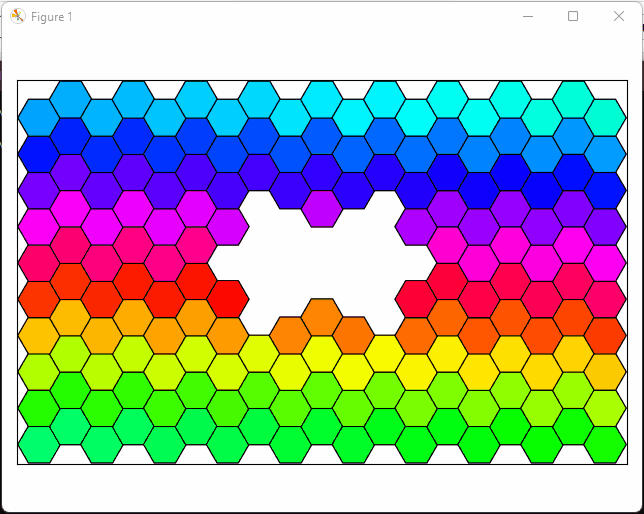

https://srgbmods.net/picoled/

NOTE: bug in YAML + scientific notation

**TABLE OF CONTENTS**

<!-- TOC depthFrom:1 depthTo:6 withLinks:1 updateOnSave:1 orderedList:0 -->

- [WP3: Wilson's Pew-Pew Panels](#wp3-wilsons-pew-pew-panels)
- [Software dependencies](#software-dependencies)
	- [Python / Anaconda](#python-anaconda)
	- [FreeCAD](#freecad)
- [Designing the panels](#designing-the-panels)
	- [Launching `wp3_designer.py`](#launching-wp3designerpy)
	- [`wp3_designer.py`: quick overview](#wp3designerpy-quick-overview)
	- [Configuration of the designer](#configuration-of-the-designer)
		- [Panels](#panels)
		- [Materials](#materials)
		- [Assembly](#assembly)
	- [Updating the CAD](#updating-the-cad)
- [Building the panels](#building-the-panels)

<!-- /TOC -->


# WP3: Wilson's Pew-Pew Panels

This project provides a modular design for hexagonal A-RGB panels. The project includes a python script (`wp3_designer.py`) that allows to design a custom composition of panels and then outputs a bill of materials. A parametric CAD file (that can be edited in [FreeCAD](https://www.freecadweb.org/)) allows to quickly generate a STL file with appropriate dimensions to 3D print the edges of the panels.

These panels are mainly meant to be used with [SignalRGB](https://www.signalrgb.com/), which runs under Windows. Therefore, the software and the instructions below have been created/tested in such environment. I am 99% confident that the same can be done in Ubuntu -the 1% of in-confidence is simply due to the fact that I have not tested it. However, I know and have used the tools individually in Ubuntu at some point of my life. I have no idea in other environments, such as MacOS, but feel free to give it a try!


# Software dependencies


## FreeCAD

This should be very easy: just head to the [FreeCAD download page](https://www.freecadweb.org/downloads.php) and download the installer. Launch it and install the software.


## Python / Anaconda

| Note: this is an optional dependency that is required only if you wish to run the script from its source. You can otherwise just run the "compiled" script (see the section [Launching `wp3_designer.py`](#launching-wp3designerpy)). |
| --- |

The `wp3_designer.py` script requires a valid Python installation with very few additional packages. If you know how to use Python already, just make sure that the packages `Matplotlib`, `NumPy` and `PyYAML` are installed and skip to the next section. If you do not know how to install Python, or you are not entirely sure, here is a quick and simple way based on [Anaconda](https://www.anaconda.com/).

1. Download the installer from the [Anaconda Distribution](https://www.anaconda.com/products/distribution) page.
1. Install Anaconda by following the wizard. The default options should be fine.
1. Launch Anaconda Navigator and on the left select *Environments*.
1. You should see a pre-installed environment, named *base (root)*. In the bottom, you should be able to create a new environment by clicking on the *create* button (featuring a "+" icon).
1. Give a name to the environment.
1. Make sure that, next to the label *Packages*, *Python* is checked while *R* is unchecked. You should be able to select a Python version. I recommend using `3.9.XX` since is the one I used, but do as you please.
1. Click on *Create* and wait for the environment to be ready.
1. You should see a list of packages that are already installed. On the top, switch from the option *Installed* to *All*.
1. On the top-right, there should be a package search bar. Click inside it and type `numpy`. In the list, look for the package named `numpy` and select it. Go back to the search bar and type `matplotlib`, then select `matplotlib` from the package list. Do the same a third time to locate and select the package `pyyaml`. Note that there might also be a `pyaml` package, with a single `y`. Do not select this one! To recap: `pyyaml` good, `pyaml` bad.
1. In the bottom right corner you should see a green button showing the text *Apply*: click on it. Anaconda will then open a pop-up window asking to install several packages. Click on *Apply* to install the three selected packages and their dependencies. This might take a while, just be patient and wait.


Python is now configured! You can close the Anaconda navigator and proceed to the next step. If you are having troubles


# Designing the panels

The design pipeline is quite simple: you firstly launch the script `wp3_designer.py` (or its executable equivalent, `wp3_designer.exe`), which allows to create a custom design for a set of hexagonal panels. Once the design is ready, the script provides some information about the material to be purchased and few "instructions" to manufacture the panels. You then have to adapt the CAD files and export STL meshes for 3D printing.


## Launching the designer

To start the designer, you have two options:

- Using the "compiled" version of the script, `wp3_designer.exe`. This is recommended if you are new to Python and/or not willing to install it.
- Running the script itself from a terminal. This might be interesting if you plan to modify the script at some point.


### Using the `wp3_designer.exe` executable

| This feature is not yet available. In the future, I will make it so that the code is "compiled" into an executable and automatically added to the GitHub repo. Then, I will include here the instructions to download it. |
| --- |

For self: compile using:
```
pyinstaller wp3_designer.py --onefile --splash imgs\cad_blueprint.png
```


### Launching `wp3_designer.py` from the command line

If you already used Python before, this should sound very familiar. If you did not, I hope the procedure is clear and detailed enough to make it easy and painless. Anyway, here is what you need to do:

1. Open Anaconda Navigator.
1. On the left, select *Environments*.
1. Select the environment that you previously created.
1. Once it has bee activated, click on the green button with the "play" icon, next to the environment name.
1. Select the option *Open Terminal* (it should be the first one).
1. A command prompt should open. Go to the location of this project using the `cd` command followed by the path to the directory that contains it. The command might look like the following:
```bash
cd C:\Users\franco\Documents\programming\wp3
```
1. Now type `python wp3_designer.py`. That should be all!


## `wp3_designer`: quick overview

After launching the script, a window should open, that looks like the following:


This is the design window, that allows you to create a custom composition of panels that you will later build. To change the composition, you can do the following:

- Click anywhere within the design space to add or remove a hexagon.
- Press `A` to remove all hexagons, `CTRL+A` to fill the space with as many hexagons as possible.
- Press the space bar to toggle all hexagons. As an example, if you press the space bar right after startup you should see the following:



Once you are satisfied with a design, just close the window. The program will now start a routing step, in which it tries to determine a nice placement for the cables, so that you do not need an exaggerate amount of wire and the back of the panels does not become a tangled mess. The routing process starts with a random path of wire from one panel to the other, you can press the space bar to let the algorithm do its job. It takes a while, but the first run makes a huge difference. After the routing has been optimized, it is shown again for validation. Keep in mind that the implemented algorithm is very simple and sometimes struggles to find nice solutions. To overcome its limitation, you can repeat the process as many times as you want (just hit the space bar again) or manually adjust the routing when assembling the panels. Here is an example of the routing, before and after the algorithm did its job:


Once you are satisfied with the obtained routing, you can close the window. The program will now generate a couple of files that detail what components are needed and in which quantity to create the custom design.

In particular, the designer will now:

- Count the number of hexagons in the design.
- Calculate the number of parts that have to be 3D printed and indicate which parameters have to be updated in the CAD.
- Determine the best placement of hexagons inside plexiglass sheets and similar.
- Calculate how many sheets of plexiglass and other materials need to be purchased to manufacture the panels.
- Evaluate how many LED strips are to be purchased and estimate the required wattage.
- Count how many connectors are needed and how much wire should be purchased.

A markdown document named `bill_of_materials.md` is produced and stored inside the folder `design_info`, listing the materials to be purchased. In the same folder, additional files can be found, such as the routing scheme.


## Configuration of the designer

Describe how to change the parameters in `config.yaml`.

Note about scientific notation in PyYAML (bug that requires the format `1.0e-2` instead of `1e-2`).


### Panels

Grouped under `panels`.

| Parameter | Type | Description |
| :-------: | :--: | ----------- |
| `rows` | `int` | Number of rows in the designer area. |
| `columns`| `int` | Number of columns in the designer area. |
| `side_length` | `float` | Length of a hexagonal tile, in meters. |
| `spacing` | `float` | Distance between the sides of two adjacent hexagonal tiles, in meters. |
| `vertical_stacking` | `bool` | Orientation of the hexagonal tiles. If `True`, then the hexagons are flat on the top and bottom, and pointy on the right and left. If `False`, it is the opposite. |
| `initial_tiling` | `array` | This parameter allows to load a custom design on startup. After generating a composition of panels, the designer will print in the console an array to be copied verbatim in this parameter. The array is just a list of row-column pairs corresponding to hexagons that should be visible on launch. |


### Routing

Grouped under `routing`.

| Parameter | Type | Description |
| :-------: | :--: | ----------- |
| `max_attempts`| `int` | Number of columns in the designer area. |
| `improvement_steps` | `float` | Length of a hexagonal tile, in meters. |
| `cache` | `int` | Number of rows in the designer area. |


### Materials

Grouped under `materials/leds/strip_name`. Each entry should have:

| Parameter | Type | Description |
| :-------: | :--: | ----------- |
| `number_of_leds` | `int` | Number of LEDs in the strip. |
| `leds_per_meter`| `int` or `float` | LEDs per meter in the strip. |
| `watts` | `float` | Optional. Power consumption of the strip. |
| `cost` | `float` | Optional. Cost of the strip. |
| `url` | `str` | Optional. Link to purchase the strip. |

Grouped under `materials/sheets/sheet_name`. Each entry should have:

| Parameter | Type | Description |
| :-------: | :--: | ----------- |
| `size` | `[float, float]` | Width and height/length of the sheet. If a sheet is sold with variable height/length, you can replace it with `inf` and the designer will select an appropriate size. |
| `cost` | `float` | Optional. Cost of the sheet. If the height/length of the sheet is `inf`, then the cost is assumed to be per unit of length. |


### Assembly

Explain the entries under `assembly/leds` and `assembly/sheets`.


## Updating the CAD

The provided CAD file is parametric, meaning that you can change some values and the whole design will be updated accordingly. There are two types of component to be printed: *inner walls* (sides shared by two panels) and *outer walls* (sides belonging to a unique hexagon). The difference is that inner walls have a small support for the acrylic panels on both sides, while outer walls have this support on one side only. Here is a sketch of an outer wall:


Green measures represent parameters that can be changed in FreeCAD to customize the component. In principle, you should just update the parameters *Side Length* and *Spacing* to reflect the choices you made for your panels, but you can play around with the others as well if you want to.

Whatever your decision, to update the CAD start by opening the file `cad/wall.FCStd` in FreeCAD. Now, follow these steps:

1. On the left, you should be able to locate a spreadsheet named *parameters*. Double click on it to open the spreadsheet view.
1. You can now change the parameters as needed. As mentioned, you probably just need to update *Side Length* and *Spacing* (and perhaps *Plexiglass Thickness* depending on the plexiglass sheets that you are going to purchase).
1. Back in the combo view (the menu on the left), select the object named *inner-wall* by double clicking on it.
1. Go to *File/Export* and select *STL Mesh (\*.stl)* as file type. Give it the name *inner-wall.stl* and export it.
1. Do the same with the *outer-wall* body, exporting as *outer-wall.stl*.


If you wish to change something more than length and width of the walls, just keep in mind the following:

- Dimensions are in millimeters since this is a popular standard in CAD software - and also in the 3D printing community.
- The parameter *Panel Support Lateral Play* should likely be kept unchanged. It is used to shrink the panel support bar to avoid issues when assembling the panels. If you want, you can increase it a little and see what it does.
- The parameter *Junction Indentation* should be strictly between zero and half of the side length. It should not be too large, to allow enough stability and support, but also not to small, to let multiple wires pass through it.
- *Panel Support Height* should be smaller than *Junction Height* minus *Plexiglass Thickness*.
- The LED strip should be glued on the lower part of the wall: make sure there is enough space for it!


# Building the panels

TODO
